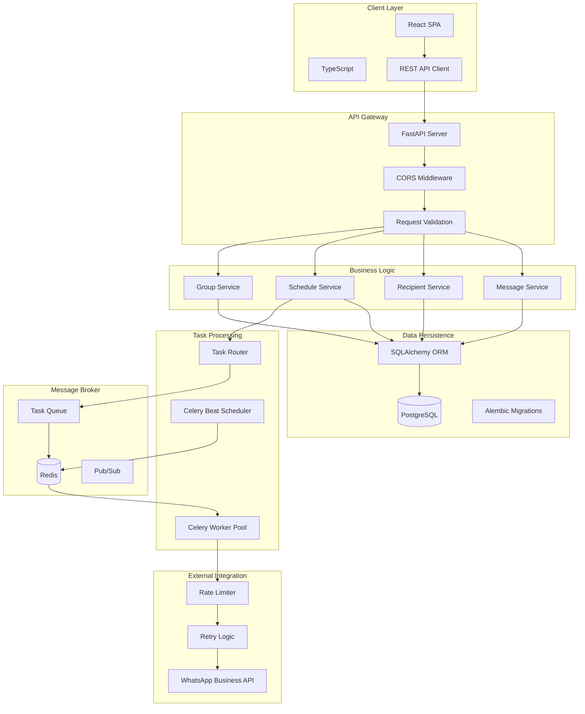
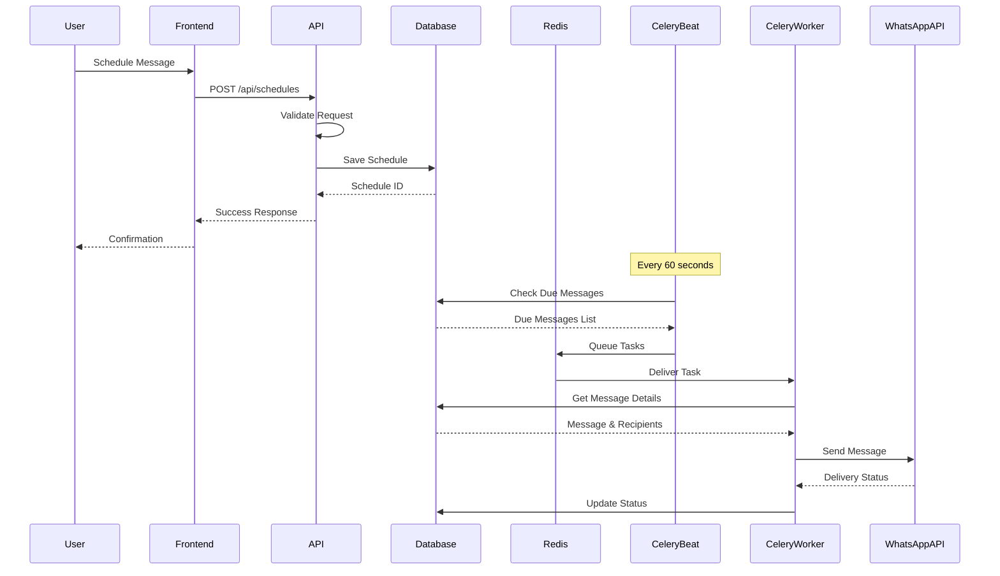
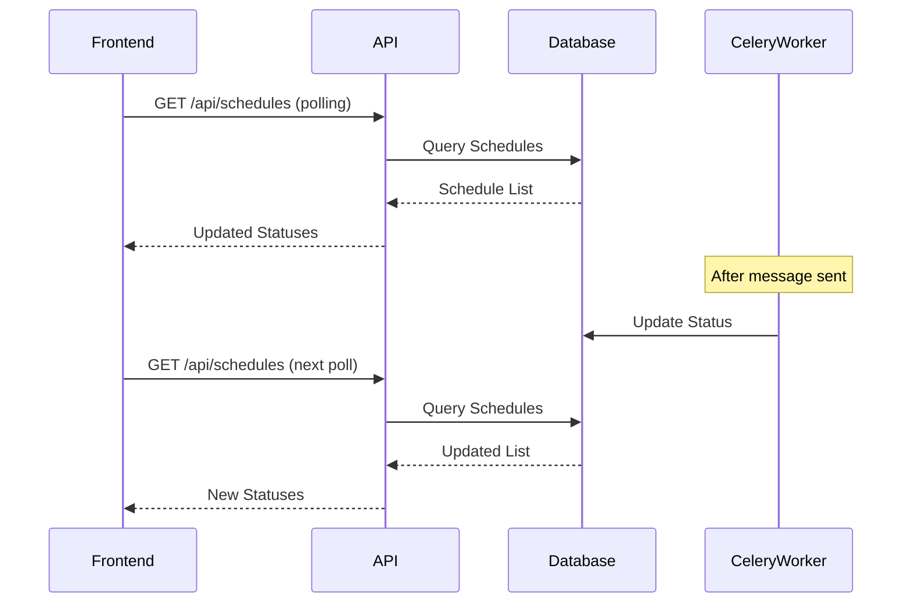
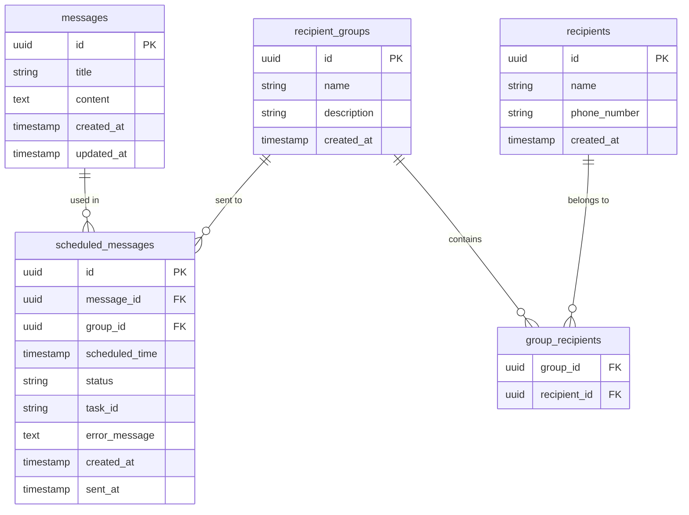
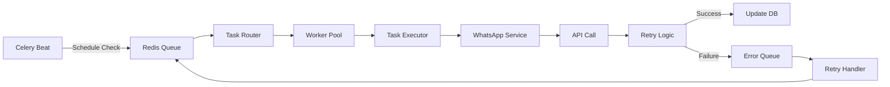
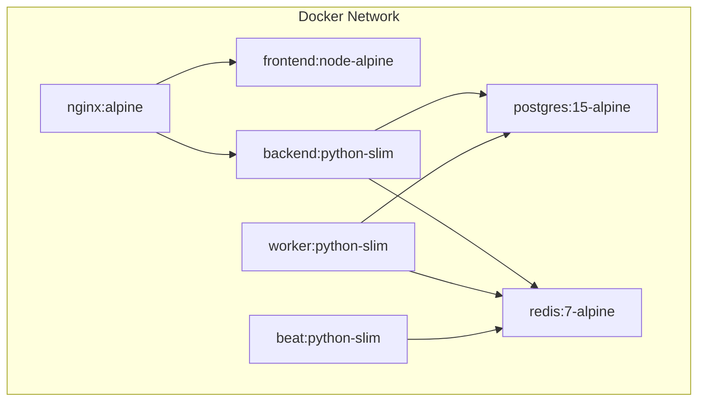
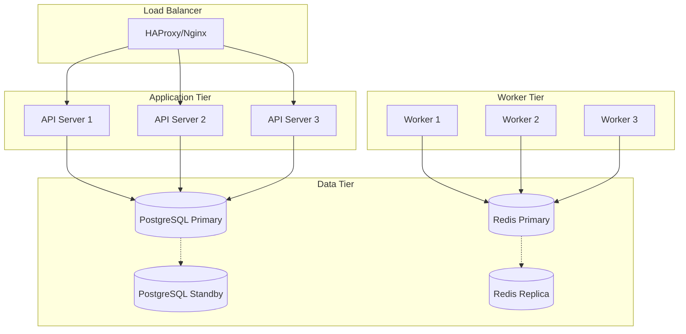

# WhatsApp Scheduler - System Architecture

## Table of Contents
- [Overview](#overview)
- [System Design](#system-design)
- [Component Architecture](#component-architecture)
- [Data Flow](#data-flow)
- [Database Design](#database-design)
- [Message Processing Pipeline](#message-processing-pipeline)
- [Deployment Architecture](#deployment-architecture)
- [Technology Decisions](#technology-decisions)
- [Scalability Considerations](#scalability-considerations)
- [High Availability](#high-availability)

## Overview

WhatsApp Scheduler is built using a **microservices architecture** that separates concerns across multiple specialized services. This design ensures scalability, maintainability, and fault tolerance while providing a seamless user experience for scheduling and automating WhatsApp messages.

## System Design

### Architecture Diagram



### Architectural Principles

1. **Separation of Concerns**: Each service handles a specific domain
2. **Loose Coupling**: Services communicate through well-defined interfaces
3. **High Cohesion**: Related functionality is grouped together
4. **Fault Tolerance**: Individual service failures don't cascade
5. **Scalability**: Services can be scaled independently

## Component Architecture

### Frontend Architecture

```
frontend/
├── src/
│   ├── components/          # React components
│   │   ├── MessageList.tsx
│   │   ├── MessageScheduler.tsx
│   │   ├── RecipientManager.tsx
│   │   └── ScheduledMessages.tsx
│   ├── contexts/           # React contexts
│   │   └── LanguageContext.tsx
│   ├── services/           # API integration
│   │   └── api.ts
│   └── utils/              # Utility functions
│       └── phoneFormatter.ts
```

**Key Design Decisions:**
- **Component-based Architecture**: Reusable UI components
- **Context API**: Global state management for language selection
- **Service Layer**: Centralized API communication
- **TypeScript**: Type safety and better developer experience

### Backend Architecture

```
backend/
├── app/
│   ├── api/               # API endpoints
│   │   ├── messages.py
│   │   ├── recipients.py
│   │   └── schedules.py
│   ├── models/            # Database models
│   │   ├── message.py
│   │   ├── recipient.py
│   │   └── schedule.py
│   ├── services/          # Business logic
│   │   └── whatsapp.py
│   ├── tasks/             # Async tasks
│   │   └── whatsapp_tasks.py
│   ├── schemas.py         # Pydantic models
│   └── database.py        # Database configuration
```

**Key Components:**

1. **API Layer** (FastAPI)
   - RESTful endpoint design
   - Automatic request/response validation
   - OpenAPI documentation generation
   - Async request handling

2. **Service Layer**
   - Business logic encapsulation
   - WhatsApp API integration
   - Error handling and retry logic

3. **Data Layer** (SQLAlchemy)
   - ORM for database abstraction
   - Connection pooling
   - Transaction management

4. **Task Layer** (Celery)
   - Asynchronous task processing
   - Scheduled job execution
   - Retry mechanisms

## Data Flow

### Message Scheduling Flow



### Real-time Status Updates



## Database Design

### Entity Relationship Diagram



### Database Schema Details

1. **Messages Table**
   - Stores reusable message templates
   - Supports rich text content
   - Tracks creation and modification times

2. **Recipients Table**
   - Individual contact information
   - Phone number validation and formatting
   - Unique constraint on phone numbers

3. **Recipient Groups Table**
   - Logical grouping of recipients
   - Many-to-many relationship with recipients
   - Supports bulk messaging

4. **Scheduled Messages Table**
   - Links messages to recipient groups
   - Tracks scheduling and delivery status
   - Stores error information for failed deliveries

### Status Flow

```
pending → processing → sent
                    ↘ failed
                    ↘ cancelled
                    ↘ archived
```

## Message Processing Pipeline

### Task Queue Architecture



### Processing Steps

1. **Schedule Detection**
   - Celery Beat runs every 60 seconds
   - Queries database for messages due within next minute
   - Creates tasks for each pending message

2. **Task Distribution**
   - Tasks are serialized and queued in Redis
   - Workers pull tasks based on availability
   - Load balancing across worker pool

3. **Message Processing**
   - Worker retrieves full message details
   - Fetches recipient list from group
   - Calls WhatsApp API for each recipient

4. **Error Handling**
   - Automatic retry with exponential backoff
   - Maximum 3 retry attempts
   - Failed messages stored with error details

## Deployment Architecture

### Container Architecture



### Production Deployment Options

1. **Railway (Primary)**
   ```
   ┌─────────────┐     ┌─────────────┐     ┌─────────────┐
   │   Web App   │     │   Worker    │     │    Beat     │
   │  (FastAPI)  │     │  (Celery)   │     │  (Celery)   │
   └──────┬──────┘     └──────┬──────┘     └──────┬──────┘
          │                    │                    │
          └────────────────────┴────────────────────┘
                               │
                    ┌──────────┴──────────┐
                    │                     │
              ┌─────▼─────┐        ┌─────▼─────┐
              │PostgreSQL │        │   Redis   │
              └───────────┘        └───────────┘
   ```

2. **Kubernetes Architecture**
   ```yaml
   Deployments:
   - frontend (3 replicas)
   - backend (3 replicas)
   - worker (5 replicas)
   - beat (1 replica)
   
   Services:
   - frontend-service (LoadBalancer)
   - backend-service (ClusterIP)
   - postgres-service (ClusterIP)
   - redis-service (ClusterIP)
   ```

## Technology Decisions

### Why FastAPI?
- **Performance**: ASGI-based, handles 30k+ requests/sec
- **Developer Experience**: Type hints, auto-documentation
- **Modern**: Native async/await support
- **Validation**: Automatic request/response validation

### Why Celery?
- **Reliability**: Battle-tested task queue
- **Features**: Scheduling, retries, monitoring
- **Flexibility**: Multiple broker support
- **Scalability**: Horizontal scaling of workers

### Why PostgreSQL?
- **ACID Compliance**: Data integrity guarantees
- **Performance**: Excellent for complex queries
- **Features**: JSON support, full-text search
- **Reliability**: Proven in production

### Why Redis?
- **Speed**: In-memory operations
- **Pub/Sub**: Real-time messaging
- **Persistence**: Optional data persistence
- **Simplicity**: Easy to deploy and manage

### Why React + TypeScript?
- **Type Safety**: Catch errors at compile time
- **Component Reuse**: Modular architecture
- **Ecosystem**: Rich library ecosystem
- **Performance**: Virtual DOM, efficient updates

## Scalability Considerations

### Horizontal Scaling Strategy

1. **Frontend**
   - Static asset CDN distribution
   - Multiple container replicas
   - Load balancer distribution

2. **API Server**
   - Stateless design enables scaling
   - Connection pooling for database
   - Async request handling

3. **Worker Pool**
   - Add workers based on queue depth
   - Auto-scaling based on CPU/memory
   - Task routing for specialization

4. **Database**
   - Read replicas for query distribution
   - Connection pooling optimization
   - Query optimization and indexing

### Performance Metrics

- **API Response Time**: < 100ms (p95)
- **Task Processing**: < 5s per message
- **Database Queries**: < 50ms (p95)
- **Worker Throughput**: 1000 messages/minute/worker

### Bottleneck Analysis

1. **WhatsApp API Rate Limits**
   - Solution: Implement rate limiting
   - Queue throttling based on limits
   - Spread load across time

2. **Database Connections**
   - Solution: Connection pooling
   - Read replica distribution
   - Query optimization

3. **Worker Memory**
   - Solution: Batch processing
   - Memory-efficient task design
   - Worker recycling

## High Availability

### Fault Tolerance Design



### Failure Scenarios

1. **API Server Failure**
   - Load balancer health checks
   - Automatic failover to healthy instances
   - No single point of failure

2. **Worker Failure**
   - Task acknowledgment ensures no loss
   - Other workers pick up tasks
   - Automatic worker restart

3. **Database Failure**
   - Automatic failover to standby
   - Point-in-time recovery capability
   - Regular automated backups

4. **Redis Failure**
   - Redis persistence enabled
   - Replica for failover
   - Task state recovery

### Monitoring & Observability

1. **Application Metrics**
   - Request rate and latency
   - Error rates and types
   - Resource utilization

2. **Infrastructure Metrics**
   - Container health
   - Database performance
   - Queue depth and latency

3. **Business Metrics**
   - Messages sent/failed
   - Delivery success rate
   - User engagement

### Disaster Recovery

1. **Backup Strategy**
   - Daily database backups
   - Point-in-time recovery
   - Cross-region backup storage

2. **Recovery Procedures**
   - Documented runbooks
   - Automated recovery scripts
   - Regular disaster recovery drills

3. **RTO/RPO Targets**
   - Recovery Time Objective: < 1 hour
   - Recovery Point Objective: < 5 minutes
   - Data integrity validation

## Conclusion

The WhatsApp Scheduler architecture is designed for reliability, scalability, and maintainability. The microservices approach allows independent scaling of components, while the use of proven technologies ensures production readiness. The system can handle thousands of scheduled messages while maintaining high availability and data integrity.