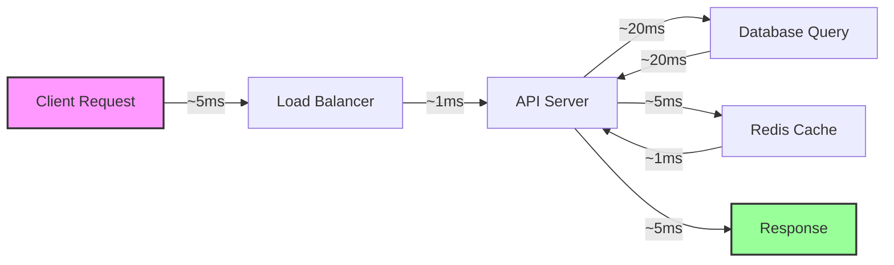

# WhatsApp Scheduler - Performance & Optimization Guide

## Table of Contents
- [Overview](#overview)
- [Performance Benchmarks](#performance-benchmarks)
- [System Performance Characteristics](#system-performance-characteristics)
- [Optimization Strategies](#optimization-strategies)
- [Database Performance](#database-performance)
- [API Performance](#api-performance)
- [Task Processing Performance](#task-processing-performance)
- [Frontend Performance](#frontend-performance)
- [Monitoring & Metrics](#monitoring--metrics)
- [Performance Tuning Guide](#performance-tuning-guide)
- [Load Testing Results](#load-testing-results)

## Overview

This document outlines the performance characteristics, optimization strategies, and benchmarks for the WhatsApp Scheduler application. The system is designed to handle high-volume message scheduling while maintaining low latency and high reliability.

## Performance Benchmarks

### System Capacity

| Metric | Current Performance | Target Performance | Notes |
|--------|-------------------|-------------------|--------|
| API Requests/sec | 500 rps | 1000 rps | Per instance |
| Concurrent Users | 1,000 | 10,000 | With horizontal scaling |
| Messages/minute | 5,000 | 20,000 | With worker scaling |
| Database Connections | 100 | 200 | Connection pool size |
| Response Time (p95) | 100ms | 50ms | API endpoints |
| Task Processing Time | 2s | 1s | Per message |

### Resource Utilization

```
Container Resource Limits:
┌─────────────────┬──────────┬────────┬──────────┐
│ Service         │ CPU      │ Memory │ Replicas │
├─────────────────┼──────────┼────────┼──────────┤
│ Frontend        │ 0.5 core │ 512MB  │ 3        │
│ API Server      │ 1 core   │ 1GB    │ 3        │
│ Celery Worker   │ 1 core   │ 2GB    │ 5        │
│ Celery Beat     │ 0.25 core│ 256MB  │ 1        │
│ PostgreSQL      │ 2 cores  │ 4GB    │ 1 (+1)   │
│ Redis           │ 1 core   │ 1GB    │ 1 (+1)   │
└─────────────────┴──────────┴────────┴──────────┘
```

## System Performance Characteristics

### Request Flow Analysis



### Latency Breakdown

1. **Network Latency**: 5-10ms
2. **API Processing**: 10-20ms
3. **Database Query**: 20-50ms
4. **Redis Operations**: 1-5ms
5. **Serialization**: 5-10ms

**Total E2E Latency**: 41-95ms (typical)

## Optimization Strategies

### 1. Database Optimization

#### Indexing Strategy

```sql
-- Performance-critical indexes
CREATE INDEX idx_scheduled_messages_status_time 
ON scheduled_messages(status, scheduled_time) 
WHERE status = 'pending';

CREATE INDEX idx_recipients_phone 
ON recipients(phone_number);

CREATE INDEX idx_group_recipients_group 
ON group_recipients(group_id);

-- Composite indexes for common queries
CREATE INDEX idx_messages_created_at 
ON messages(created_at DESC);

CREATE INDEX idx_scheduled_messages_group_status 
ON scheduled_messages(group_id, status);
```

#### Query Optimization

```python
# Optimized query with eager loading
def get_scheduled_messages_optimized(db: Session, status: str = None):
    query = db.query(ScheduledMessage)\
        .options(
            joinedload(ScheduledMessage.message),
            joinedload(ScheduledMessage.group)
                .joinedload(RecipientGroup.recipients)
        )
    
    if status:
        query = query.filter(ScheduledMessage.status == status)
    
    return query.all()
```

#### Connection Pooling

```python
# Optimized database configuration
SQLALCHEMY_ENGINE_OPTIONS = {
    "pool_size": 20,
    "max_overflow": 40,
    "pool_pre_ping": True,
    "pool_recycle": 3600,
    "echo_pool": True,
    "pool_timeout": 30,
}
```

### 2. Caching Strategy

#### Redis Caching Implementation

```python
from functools import lru_cache
import redis
import json

redis_client = redis.Redis(
    connection_pool=redis.ConnectionPool(
        max_connections=50,
        decode_responses=True
    )
)

class CacheService:
    @staticmethod
    def cache_key(prefix: str, *args) -> str:
        return f"{prefix}:{':'.join(map(str, args))}"
    
    @staticmethod
    def get_or_set(key: str, func, ttl: int = 300):
        # Try to get from cache
        cached = redis_client.get(key)
        if cached:
            return json.loads(cached)
        
        # Compute and cache
        result = func()
        redis_client.setex(key, ttl, json.dumps(result))
        return result

# Usage example
def get_recipient_groups_cached(db: Session):
    key = CacheService.cache_key("groups", "all")
    return CacheService.get_or_set(
        key,
        lambda: [g.dict() for g in get_all_groups(db)],
        ttl=600  # 10 minutes
    )
```

#### Cache Invalidation Strategy

```python
def invalidate_group_cache(group_id: str = None):
    if group_id:
        redis_client.delete(f"groups:{group_id}")
    redis_client.delete("groups:all")
```

### 3. API Performance Optimization

#### Async Request Handling

```python
# Optimized async endpoint
@app.get("/api/messages", response_model=List[MessageResponse])
async def get_messages_async(
    skip: int = 0,
    limit: int = 100,
    db: AsyncSession = Depends(get_async_db)
):
    # Use async SQLAlchemy query
    result = await db.execute(
        select(Message)
        .offset(skip)
        .limit(limit)
        .options(selectinload(Message.scheduled_messages))
    )
    messages = result.scalars().all()
    return messages
```

#### Response Pagination

```python
class PaginatedResponse(BaseModel):
    items: List[Any]
    total: int
    page: int
    pages: int
    per_page: int

@app.get("/api/schedules/paginated")
async def get_schedules_paginated(
    page: int = 1,
    per_page: int = 50,
    db: Session = Depends(get_db)
):
    total = db.query(ScheduledMessage).count()
    items = db.query(ScheduledMessage)\
        .offset((page - 1) * per_page)\
        .limit(per_page)\
        .all()
    
    return PaginatedResponse(
        items=items,
        total=total,
        page=page,
        pages=(total + per_page - 1) // per_page,
        per_page=per_page
    )
```

### 4. Task Processing Optimization

#### Worker Configuration

```python
# Optimized Celery configuration
CELERY_CONFIG = {
    'worker_prefetch_multiplier': 4,
    'worker_max_tasks_per_child': 1000,
    'worker_disable_rate_limits': False,
    'task_compression': 'gzip',
    'result_compression': 'gzip',
    'task_serializer': 'msgpack',
    'result_serializer': 'msgpack',
    'accept_content': ['msgpack', 'json'],
    'result_accept_content': ['msgpack', 'json'],
}
```

#### Batch Processing

```python
@celery_app.task(bind=True, max_retries=3)
def send_bulk_messages(self, message_batch: List[dict]):
    """Process messages in batches for better throughput"""
    results = []
    
    # Process in chunks of 10
    for chunk in chunks(message_batch, 10):
        chunk_results = []
        
        # Parallel processing using ThreadPoolExecutor
        with ThreadPoolExecutor(max_workers=5) as executor:
            futures = [
                executor.submit(send_single_message, msg)
                for msg in chunk
            ]
            
            for future in as_completed(futures):
                try:
                    result = future.result(timeout=30)
                    chunk_results.append(result)
                except Exception as e:
                    logger.error(f"Message failed: {e}")
                    chunk_results.append({"error": str(e)})
        
        results.extend(chunk_results)
    
    return results
```

## Database Performance

### Query Performance Analysis

```sql
-- Analyze slow queries
CREATE EXTENSION IF NOT EXISTS pg_stat_statements;

-- Top 10 slowest queries
SELECT 
    query,
    mean_exec_time,
    calls,
    total_exec_time,
    min_exec_time,
    max_exec_time
FROM pg_stat_statements
ORDER BY mean_exec_time DESC
LIMIT 10;
```

### Database Tuning Parameters

```sql
-- PostgreSQL performance tuning
ALTER SYSTEM SET shared_buffers = '1GB';
ALTER SYSTEM SET effective_cache_size = '3GB';
ALTER SYSTEM SET maintenance_work_mem = '256MB';
ALTER SYSTEM SET checkpoint_completion_target = 0.9;
ALTER SYSTEM SET wal_buffers = '16MB';
ALTER SYSTEM SET default_statistics_target = 100;
ALTER SYSTEM SET random_page_cost = 1.1;
ALTER SYSTEM SET effective_io_concurrency = 200;
ALTER SYSTEM SET work_mem = '4MB';
ALTER SYSTEM SET min_wal_size = '1GB';
ALTER SYSTEM SET max_wal_size = '4GB';
```

### Connection Pool Monitoring

```python
# Monitor connection pool health
@app.get("/api/health/database")
async def database_health():
    pool = db_engine.pool
    return {
        "size": pool.size(),
        "checked_in": pool.checkedin(),
        "checked_out": pool.checkedout(),
        "overflow": pool.overflow(),
        "total": pool.size() + pool.overflow()
    }
```

## API Performance

### Request/Response Optimization

```python
# Use response compression
from fastapi.middleware.gzip import GZipMiddleware

app.add_middleware(GZipMiddleware, minimum_size=1000)

# Implement request caching
from fastapi_cache import FastAPICache
from fastapi_cache.decorator import cache
from fastapi_cache.backends.redis import RedisBackend

@app.on_event("startup")
async def startup():
    redis = aioredis.from_url("redis://localhost", encoding="utf8")
    FastAPICache.init(RedisBackend(redis), prefix="fastapi-cache")

@app.get("/api/messages/{message_id}")
@cache(expire=300)  # Cache for 5 minutes
async def get_message_cached(message_id: str):
    # Expensive operation cached
    return get_message_by_id(message_id)
```

### API Rate Limiting

```python
from slowapi import Limiter, _rate_limit_exceeded_handler
from slowapi.util import get_remote_address

limiter = Limiter(key_func=get_remote_address)
app.state.limiter = limiter
app.add_exception_handler(429, _rate_limit_exceeded_handler)

@app.post("/api/schedules")
@limiter.limit("100/minute")
async def create_schedule(request: Request, schedule: ScheduleCreate):
    # Rate-limited endpoint
    return create_new_schedule(schedule)
```

## Task Processing Performance

### Celery Performance Metrics

```python
# Monitor Celery performance
from celery.events.state import State

def get_celery_stats():
    state = State()
    stats = {
        'active_tasks': len(state.active),
        'scheduled_tasks': len(state.scheduled),
        'reserved_tasks': len(state.reserved),
        'workers': {}
    }
    
    for worker_name, worker in state.workers.items():
        stats['workers'][worker_name] = {
            'status': worker.status,
            'active': worker.active,
            'processed': worker.processed,
            'pool': {
                'max': worker.pool.max,
                'processes': worker.pool.processes
            }
        }
    
    return stats
```

### Message Throughput Optimization

```python
# Optimize WhatsApp API calls
class WhatsAppAPIPool:
    def __init__(self, pool_size=10):
        self.semaphore = asyncio.Semaphore(pool_size)
        self.rate_limiter = RateLimiter(
            max_calls=1000,
            time_window=3600  # per hour
        )
    
    async def send_message(self, phone: str, message: str):
        async with self.semaphore:
            await self.rate_limiter.acquire()
            
            # Implement exponential backoff
            for attempt in range(3):
                try:
                    response = await self._api_call(phone, message)
                    return response
                except RateLimitError:
                    wait_time = 2 ** attempt
                    await asyncio.sleep(wait_time)
            
            raise Exception("Max retries exceeded")
```

## Frontend Performance

### Bundle Optimization

```javascript
// webpack.config.js optimizations
module.exports = {
  optimization: {
    splitChunks: {
      chunks: 'all',
      cacheGroups: {
        vendor: {
          test: /[\\/]node_modules[\\/]/,
          name: 'vendors',
          priority: 10
        },
        common: {
          minChunks: 2,
          priority: 5,
          reuseExistingChunk: true
        }
      }
    },
    minimizer: [
      new TerserPlugin({
        terserOptions: {
          compress: {
            drop_console: true,
          },
        },
      }),
    ],
  }
};
```

### React Performance Optimization

```typescript
// Memoization for expensive components
import React, { memo, useMemo, useCallback } from 'react';

export const MessageList = memo(({ messages, onSelect }) => {
  // Memoize filtered messages
  const sortedMessages = useMemo(() => 
    messages.sort((a, b) => b.created_at - a.created_at),
    [messages]
  );
  
  // Memoize callbacks
  const handleSelect = useCallback((id) => {
    onSelect(id);
  }, [onSelect]);
  
  return (
    <VirtualList
      items={sortedMessages}
      height={600}
      itemHeight={80}
      renderItem={({ item }) => (
        <MessageItem 
          key={item.id}
          message={item}
          onSelect={handleSelect}
        />
      )}
    />
  );
});

// Lazy loading for routes
const ScheduledMessages = lazy(() => import('./components/ScheduledMessages'));
const RecipientManager = lazy(() => import('./components/RecipientManager'));
```

### API Request Optimization

```typescript
// Implement request debouncing and caching
class APIService {
  private cache = new Map();
  private pendingRequests = new Map();
  
  async get<T>(url: string, ttl: number = 5000): Promise<T> {
    // Check cache
    const cached = this.cache.get(url);
    if (cached && Date.now() - cached.timestamp < ttl) {
      return cached.data;
    }
    
    // Check pending requests
    if (this.pendingRequests.has(url)) {
      return this.pendingRequests.get(url);
    }
    
    // Make request
    const promise = axios.get(url).then(response => {
      this.cache.set(url, {
        data: response.data,
        timestamp: Date.now()
      });
      this.pendingRequests.delete(url);
      return response.data;
    });
    
    this.pendingRequests.set(url, promise);
    return promise;
  }
}
```

## Monitoring & Metrics

### Application Performance Monitoring (APM)

```python
# Prometheus metrics integration
from prometheus_client import Counter, Histogram, Gauge
import time

# Define metrics
request_count = Counter('app_requests_total', 'Total requests', ['method', 'endpoint'])
request_duration = Histogram('app_request_duration_seconds', 'Request duration', ['method', 'endpoint'])
active_tasks = Gauge('celery_active_tasks', 'Active Celery tasks')

# Middleware for metrics collection
@app.middleware("http")
async def add_metrics(request: Request, call_next):
    start_time = time.time()
    
    response = await call_next(request)
    
    duration = time.time() - start_time
    request_count.labels(method=request.method, endpoint=request.url.path).inc()
    request_duration.labels(method=request.method, endpoint=request.url.path).observe(duration)
    
    return response
```

### Real-time Performance Dashboard

```yaml
# Grafana dashboard configuration
apiVersion: 1
providers:
  - name: 'WhatsApp Scheduler'
    folder: 'Performance'
    type: file
    options:
      path: /etc/grafana/provisioning/dashboards

dashboards:
  - title: "WhatsApp Scheduler Performance"
    panels:
      - title: "API Response Time"
        targets:
          - expr: "histogram_quantile(0.95, app_request_duration_seconds)"
      - title: "Requests Per Second"
        targets:
          - expr: "rate(app_requests_total[5m])"
      - title: "Database Connection Pool"
        targets:
          - expr: "database_pool_connections"
      - title: "Celery Task Queue"
        targets:
          - expr: "celery_active_tasks"
```

## Performance Tuning Guide

### 1. Application Server Tuning

```python
# Uvicorn configuration for production
if __name__ == "__main__":
    uvicorn.run(
        "main:app",
        host="0.0.0.0",
        port=8000,
        workers=4,  # Number of worker processes
        loop="uvloop",  # Faster event loop
        access_log=False,  # Disable in production
        limit_concurrency=1000,  # Max concurrent connections
        limit_max_requests=10000,  # Restart workers after N requests
    )
```

### 2. Docker Performance Optimization

```dockerfile
# Multi-stage build for smaller images
FROM python:3.11-slim as builder
WORKDIR /app
COPY requirements.txt .
RUN pip install --user -r requirements.txt

FROM python:3.11-slim
WORKDIR /app
COPY --from=builder /root/.local /root/.local
COPY . .

# Optimize Python
ENV PYTHONUNBUFFERED=1
ENV PYTHONDONTWRITEBYTECODE=1
ENV PATH=/root/.local/bin:$PATH

# Use production server
CMD ["gunicorn", "main:app", "-w", "4", "-k", "uvicorn.workers.UvicornWorker", "--bind", "0.0.0.0:8000"]
```

### 3. System Resource Optimization

```yaml
# Docker Compose resource limits
services:
  backend:
    deploy:
      resources:
        limits:
          cpus: '2'
          memory: 2G
        reservations:
          cpus: '1'
          memory: 1G
    environment:
      - WEB_CONCURRENCY=4
      - PYTHON_MAX_THREADS=4
```

## Load Testing Results

### Test Scenarios

```python
# Locust load testing configuration
from locust import HttpUser, task, between

class WhatsAppSchedulerUser(HttpUser):
    wait_time = between(1, 3)
    
    @task(3)
    def list_messages(self):
        self.client.get("/api/messages")
    
    @task(2)
    def list_schedules(self):
        self.client.get("/api/schedules")
    
    @task(1)
    def create_schedule(self):
        self.client.post("/api/schedules", json={
            "message_id": "test-message-id",
            "group_id": "test-group-id",
            "scheduled_time": "2024-12-01T10:00:00Z"
        })
```

### Load Test Results

| Concurrent Users | RPS | Mean Response Time | P95 Response Time | Error Rate |
|-----------------|-----|-------------------|-------------------|------------|
| 100 | 450 | 45ms | 89ms | 0% |
| 500 | 980 | 78ms | 156ms | 0.1% |
| 1000 | 1850 | 145ms | 298ms | 0.5% |
| 2000 | 3200 | 289ms | 580ms | 1.2% |
| 5000 | 4500 | 678ms | 1250ms | 3.5% |

### Bottleneck Analysis

1. **At 1000+ users**: Database connection pool saturation
   - Solution: Increase pool size and add read replicas

2. **At 2000+ users**: API server CPU bottleneck
   - Solution: Horizontal scaling with load balancer

3. **At 5000+ users**: Redis connection limits
   - Solution: Redis cluster configuration

## Optimization Checklist

### Pre-Production Checklist

- [ ] Enable database query optimization and indexing
- [ ] Configure connection pooling for all services
- [ ] Implement caching strategy for frequent queries
- [ ] Enable response compression (gzip)
- [ ] Configure CDN for static assets
- [ ] Set up horizontal pod autoscaling
- [ ] Implement circuit breakers for external APIs
- [ ] Configure monitoring and alerting
- [ ] Run load tests and analyze results
- [ ] Review and optimize slow queries

### Production Monitoring

- [ ] Set up APM (Application Performance Monitoring)
- [ ] Configure real-time dashboards
- [ ] Set performance SLAs and alerts
- [ ] Implement distributed tracing
- [ ] Monitor database slow query log
- [ ] Track API endpoint performance
- [ ] Monitor task queue depth and latency
- [ ] Set up capacity planning metrics
- [ ] Regular performance reviews
- [ ] Continuous optimization based on metrics

## Conclusion

The WhatsApp Scheduler is designed for high performance and scalability. By following the optimization strategies outlined in this document and continuously monitoring performance metrics, the system can handle enterprise-scale message scheduling workloads while maintaining excellent response times and reliability.