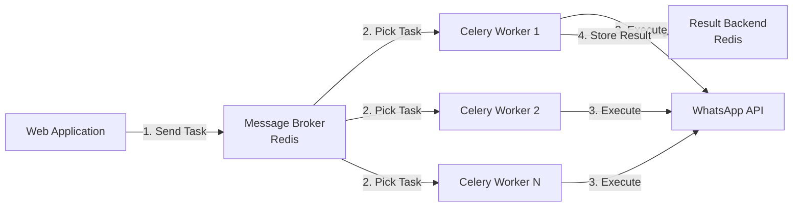

# 🔬 WhatsApp Scheduler - Technology Deep Dive

## Table of Contents

1. [What is Celery?](#-what-is-celery)
2. [What is Uvicorn?](#-what-is-celery)
2. [Why Railway?](#-why-railway)
3. [Railway Components Explained](#-railway-components-explained)
4. [Why Docker?](#-why-docker)
5. [Python Libraries Deep Dive](#-python-libraries-deep-dive)
6. [JavaScript Libraries Deep Dive](#-javascript-libraries-deep-dive)
7. [Architecture Decisions](#-architecture-decisions)

---

## 🌟 What is Celery?

### The Problem It Solves

Imagine you're at a restaurant. When you order food, the waiter doesn't make you wait at the counter while your meal is being prepared. Instead, they give you a number, you sit down, and they call you when it's ready. **Celery works the same way for software applications**.

### Definition

**Celery** is a distributed task queue - a system that allows you to run time-consuming operations in the background while your main application continues serving users.

### How It Works



### Key Concepts

1. **Task**: A unit of work (like "send this WhatsApp message")
2. **Worker**: A process that executes tasks
3. **Broker**: A message queue (Redis/RabbitMQ) that holds tasks
4. **Beat**: A scheduler that triggers periodic tasks

### In Our WhatsApp Scheduler

```python
# When user schedules a message:
@celery_app.task
def send_scheduled_message(scheduled_message_id: int):
    # This runs in the background
    # User gets immediate response
    # Message sends at scheduled time
```

**Benefits**:
- ✅ Users don't wait for WhatsApp API calls
- ✅ Can retry failed messages automatically
- ✅ Scale by adding more workers
- ✅ Survives server restarts (tasks persist in Redis)

---

## 🚀 What is Uvicorn?

### What is Uvicorn?

**Uvicorn** is a lightning-fast ASGI (Asynchronous Server Gateway Interface) server implementation, using `uvloop` and `httptools`. Think of it as the engine that powers your FastAPI application - it's what actually receives HTTP requests and sends responses.

#### The Server Stack

```
Browser → Uvicorn → FastAPI → Your Code
         ↑
    The Speed Layer
```

### ASGI vs WSGI - The Evolution

#### WSGI (Old Way)
```python
# WSGI - One request blocks the thread
def application(environ, start_response):
    time.sleep(5)  # Blocks entire thread!
    start_response('200 OK', [])
    return [b'Hello World']
```

#### ASGI (Modern Way)
```python
# ASGI - Async handling
async def application(scope, receive, send):
    await asyncio.sleep(5)  # Doesn't block!
    await send({
        'type': 'http.response.body',
        'body': b'Hello World',
    })
```

**Key Difference**: ASGI can handle thousands of concurrent connections, WSGI handles one at a time per thread.

### Why Uvicorn for Our Project

#### 1. **Perfect Match with FastAPI**
```python
# In our main.py
if __name__ == "__main__":
    uvicorn.run("main:app", host="0.0.0.0", port=8000)
```

FastAPI is built for ASGI, and Uvicorn is the recommended server.

#### 2. **Handles WhatsApp Webhooks Efficiently**
```python
# Webhook endpoint can handle many simultaneous calls
@app.post("/webhook")
async def webhook(request: Request):
    # Non-blocking processing
    background_tasks.add_task(process_webhook, await request.json())
    return {"status": "received"}
```

#### 3. **Real-time Features Ready**
- WebSocket support for future live updates
- Server-Sent Events for message status
- Long polling without blocking

### Core Features Explained

#### 1. **Async Request Handling**

**What it means**: Can process multiple requests simultaneously

```python
# Traditional (Synchronous)
def get_data():
    data1 = fetch_from_db()      # 1 second
    data2 = fetch_from_api()     # 1 second
    return data1 + data2         # Total: 2 seconds

# With Uvicorn + Async
async def get_data():
    data1, data2 = await asyncio.gather(
        fetch_from_db(),         # 1 second
        fetch_from_api()         # 1 second
    )
    return data1 + data2         # Total: 1 second!
```

**In our WhatsApp Scheduler**:
- Check message status while sending new messages
- Handle multiple schedule requests simultaneously
- Process webhooks without blocking API responses

#### 2. **WebSocket Support**

**What it means**: Real-time, two-way communication

```python
# Future enhancement: Live message status
@app.websocket("/ws/{client_id}")
async def websocket_endpoint(websocket: WebSocket, client_id: str):
    await websocket.accept()
    while True:
        # Send live updates
        await websocket.send_json({
            "message_id": 123,
            "status": "delivered",
            "timestamp": datetime.now()
        })
```

**Potential uses**:
- Live delivery status updates
- Real-time recipient typing indicators
- Instant schedule modifications

#### 3. **Development Auto-reload**

**What it means**: Changes reflect instantly

```bash
# Development mode
uvicorn main:app --reload

# When you save a file:
INFO:     Detected file change in 'app/api/messages.py'
INFO:     Reloading...
INFO:     Application startup complete.
```

**Benefits**:
- No manual restarts
- Faster development cycle
- Immediate error feedback

#### 4. **Production Ready**

**What it means**: Built for scale

```python
# Production configuration
uvicorn.run(
    "main:app",
    host="0.0.0.0",
    port=8000,
    workers=4,           # Multi-process
    loop="uvloop",       # Faster event loop
    access_log=False,    # Performance boost
    ssl_certfile="cert.pem",  # HTTPS support
)
```

## Performance Benchmarks

### Uvicorn vs Other Servers

```
Requests per second (higher is better):

Uvicorn:     ████████████████████ 15,000 req/s
Gunicorn:    ████████ 6,000 req/s  
Waitress:    ████ 3,000 req/s
Django Dev:  ██ 1,500 req/s
```

### Real-world Impact

For our WhatsApp Scheduler:
- **Scenario**: 1000 users scheduling messages simultaneously
- **Traditional Server**: 10-15 seconds response time
- **Uvicorn**: Sub-second response time

## Configuration & Usage

### Basic Usage
```bash
# Simple start
uvicorn main:app

# With options
uvicorn main:app --host 0.0.0.0 --port 8000 --reload
```

### Our Docker Configuration
```dockerfile
# In backend/Dockerfile
CMD ["uvicorn", "main:app", "--host", "0.0.0.0", "--port", "8000"]
```

### Advanced Configuration
```python
# config.py
import uvicorn

config = uvicorn.Config(
    "main:app",
    port=8000,
    log_level="info",
    access_log=True,
    use_colors=True,
    # Performance optimizations
    loop="uvloop",        # Faster event loop
    http="httptools",     # Faster HTTP parsing
    # Security
    limit_concurrency=1000,
    limit_max_requests=10000,
    timeout_keep_alive=5,
)
```

### Environment-based Configuration
```python
# main.py
import os

if __name__ == "__main__":
    uvicorn.run(
        "main:app",
        host="0.0.0.0",
        port=int(os.getenv("PORT", 8000)),
        reload=os.getenv("ENV") == "development",
        workers=int(os.getenv("WORKERS", 1)),
    )
```

### Production Deployment

#### 1. **With Gunicorn** (Recommended for production)
```bash
# Uses Gunicorn to manage Uvicorn workers
gunicorn main:app -w 4 -k uvicorn.workers.UvicornWorker
```

#### 2. **Behind Nginx**
```nginx
# nginx.conf
upstream app {
    server localhost:8000;
}

server {
    listen 80;
    location / {
        proxy_pass http://app;
        proxy_http_version 1.1;
        proxy_set_header Upgrade $http_upgrade;
        proxy_set_header Connection 'upgrade';
    }
}
```

#### 3. **Process Management**
```ini
# supervisor.conf
[program:uvicorn]
command=uvicorn main:app --host 0.0.0.0 --port 8000
directory=/app
autostart=true
autorestart=true
stderr_logfile=/var/log/uvicorn.err.log
stdout_logfile=/var/log/uvicorn.out.log
```

### Alternatives Comparison

#### Uvicorn vs Others

| Feature | Uvicorn | Hypercorn | Daphne | Gunicorn |
|---------|---------|-----------|---------|----------|
| ASGI Support | ✅ Native | ✅ Native | ✅ Native | ❌ Via worker |
| Performance | ⭐⭐⭐⭐⭐ | ⭐⭐⭐⭐ | ⭐⭐⭐ | ⭐⭐⭐ |
| WebSockets | ✅ Yes | ✅ Yes | ✅ Yes | ❌ No |
| HTTP/2 | ❌ No | ✅ Yes | ❌ No | ❌ No |
| Auto-reload | ✅ Yes | ✅ Yes | ❌ No | ✅ Yes |
| Production Ready | ✅ Yes | ✅ Yes | ✅ Yes | ✅ Yes |

#### Why We Chose Uvicorn

1. **Fastest Performance** - Critical for webhook processing
2. **FastAPI Integration** - Recommended by FastAPI docs
3. **Simple Configuration** - Less complexity than Hypercorn
4. **Battle Tested** - Used by Instagram, Microsoft, etc.

---

### In Our WhatsApp Scheduler Context

#### How Uvicorn Powers Our App

1. **API Endpoints**
   ```python
   # Handles concurrent schedule requests
   @app.post("/api/schedules")
   async def create_schedule(schedule: ScheduleCreate):
       # Uvicorn ensures this doesn't block other requests
       result = await db.execute(...)
       return result
   ```

2. **Webhook Processing**
   ```python
   # WhatsApp delivery notifications
   @app.post("/webhook/whatsapp")
   async def whatsapp_webhook(request: Request):
       # Process without blocking
       background_tasks.add_task(
           process_delivery_status, 
           await request.json()
       )
       return {"status": "ok"}
   ```

3. **Health Checks**
   ```python
   # Railway/Docker health checks
   @app.get("/health")
   async def health():
       # Fast response for container orchestration
       return {"status": "healthy"}
   ```

### Performance Tips

#### 1. **Use Connection Pooling**
```python
# database.py
from sqlalchemy.ext.asyncio import create_async_engine

engine = create_async_engine(
    DATABASE_URL,
    pool_size=20,        # Reuse connections
    max_overflow=40,     # Maximum connections
    pool_pre_ping=True,  # Verify connections
)
```

#### 2. **Optimize Middleware**
```python
# Minimal middleware for performance
app.add_middleware(
    CORSMiddleware,
    allow_origins=["*"],
    allow_methods=["*"],
    allow_headers=["*"],
)
# Avoid heavy middleware in production
```

#### 3. **Use Background Tasks**
```python
# Don't block responses
@app.post("/api/messages/send")
async def send_message(
    message: MessageCreate,
    background_tasks: BackgroundTasks
):
    # Quick response
    background_tasks.add_task(send_to_whatsapp, message)
    return {"status": "queued"}
```

---

### Summary

**Uvicorn** is the engine that makes our WhatsApp Scheduler fast and scalable:

- ⚡ **Speed**: Handles thousands of requests per second
- 🔄 **Async**: Non-blocking I/O for better resource usage
- 🔌 **WebSockets**: Ready for real-time features
- 🛠️ **Developer Friendly**: Auto-reload and great error messages
- 🚀 **Production Ready**: Used by major companies worldwide

It's the perfect match for FastAPI and ensures our WhatsApp Scheduler can scale from a prototype to a production system handling millions of messages.

---

## 🚄 Why Railway?

### What is Railway?

Railway is a modern Platform-as-a-Service (PaaS) that makes deploying applications as simple as `git push`. Think of it as "Heroku, but better and more modern."

### Why We Chose Railway

1. **Zero DevOps Overhead**
   - No Kubernetes configuration
   - No server management
   - Automatic SSL certificates
   - Built-in logging and monitoring

2. **Developer Experience**
   ```bash
   # Traditional deployment
   - Configure server
   - Install dependencies
   - Set up nginx
   - Configure SSL
   - Set up monitoring
   - Configure databases
   
   # Railway deployment
   - git push
   - Done! 🎉
   ```

3. **Cost Effective**
   - Pay only for what you use
   - Free tier for development
   - Transparent pricing

4. **Instant Environments**
   - Preview environments for PRs
   - Easy rollbacks
   - Environment variables UI

---

## 🧩 Railway Components Explained

### 1. **Web Service (Backend API)**
```yaml
services:
  - type: web
    name: whatsapp-backend
```

**Purpose**: Hosts our FastAPI application
- Handles HTTP requests
- Serves API endpoints
- Auto-scales based on traffic
- Health checks included

### 2. **Worker Service (Celery Worker)**
```yaml
services:
  - type: worker
    name: whatsapp-worker
```

**Purpose**: Processes background tasks
- Sends WhatsApp messages
- Runs independently of web service
- Can scale horizontally
- Retries failed tasks

### 3. **Cron Service (Celery Beat)**
```yaml
services:
  - type: cron
    name: whatsapp-beat
    schedule: "*/1 * * * *"
```

**Purpose**: Schedules periodic tasks
- Checks for due messages every minute
- Triggers message sending
- Maintains schedule accuracy
- Single instance (no duplicates)

### 4. **Database (PostgreSQL)**
```yaml
databases:
  - name: whatsapp-scheduler-db
```

**Purpose**: Persistent data storage
- Managed PostgreSQL instance
- Automatic backups
- Connection pooling
- Zero maintenance

### 5. **Redis (via Railway)**

**Purpose**: Message broker & cache
- Task queue for Celery
- Temporary data storage
- Pub/sub messaging
- Session storage

---

## 🐳 Why Docker?

### The Problem Docker Solves

**"But it works on my machine!"** - Every developer ever

Docker ensures your application runs the same way everywhere:

```
Your Laptop → Docker Container → Production Server
    Same          Same              Same
```

### Benefits in Our Project

1. **Consistency**
   ```dockerfile
   FROM python:3.11-slim
   # Everyone uses EXACT same Python version
   ```

2. **Isolation**
   ```dockerfile
   RUN useradd -m appuser
   USER appuser
   # Secure, isolated environment
   ```

3. **Easy Development**
   ```bash
   docker-compose up
   # Entire stack running in seconds
   ```

4. **Production Ready**
   - Same container dev → staging → production
   - No surprises in production
   - Easy rollbacks

---

## 🐍 Python Libraries Deep Dive

### Core Framework

#### **FastAPI (0.104.1)**
**Why**: Modern Python web framework built for APIs

**Benefits**:
- ⚡ **Performance**: Built on Starlette & Pydantic
- 📝 **Auto Documentation**: Swagger UI included
- 🔍 **Type Hints**: Catches errors before runtime
- 🔄 **Async Support**: Handle more requests

**Alternative considered**: Flask/Django
- Flask: Less features, more setup needed
- Django: Too heavy for API-only service

#### **Uvicorn (0.24.0)**
**Why**: Lightning-fast ASGI server

**Benefits**:
- Async request handling
- WebSocket support
- Development auto-reload
- Production ready

### Database Layer

#### **SQLAlchemy (2.0.23)**
**Why**: The gold standard Python ORM

**Benefits**:
```python
# Without ORM (raw SQL)
cursor.execute(
    "INSERT INTO messages (title, content) VALUES (?, ?)",
    (title, content)
)

# With SQLAlchemy
message = Message(title=title, content=content)
db.session.add(message)
```

- SQL injection protection
- Database agnostic
- Relationship handling
- Migration support

#### **Alembic (1.12.1)**
**Why**: Database migration tool

**Benefits**:
- Version control for database schema
- Rollback capabilities
- Team collaboration
- Zero downtime migrations

#### **psycopg2-binary (2.9.9)**
**Why**: PostgreSQL adapter for Python

**Benefits**:
- Native PostgreSQL features
- Connection pooling
- Prepared statements
- Binary protocol support

### Data Validation

#### **Pydantic (2.5.0)**
**Why**: Data validation using Python type annotations

**Benefits**:
```python
# Automatic validation
class MessageCreate(BaseModel):
    title: str
    content: str
    
# Pydantic ensures data is valid
# Before it reaches your database
```

- Runtime type checking
- JSON Schema generation
- Serialization/deserialization
- Error messages

### Task Queue

#### **Celery (5.3.4)**
**Why**: Distributed task queue (covered extensively above)

#### **Redis (5.0.1)**
**Why**: In-memory data structure store

**Benefits**:
- Message broker for Celery
- 🚀 Microsecond latency
- Persistence options
- Pub/sub capabilities

### HTTP & Security

#### **Requests (2.31.0)**
**Why**: HTTP library for Python

**Benefits**:
- Simple API
- Connection pooling
- Session handling
- Retry mechanisms

#### **python-jose (3.3.0)**
**Why**: JWT implementation

**Benefits**:
- Secure token generation
- Standard JWT support
- Multiple algorithms
- Token validation

#### **passlib (1.7.4)**
**Why**: Password hashing library

**Benefits**:
- Bcrypt support
- Secure defaults
- Algorithm agility
- Legacy support

### Utilities

#### **python-dotenv (1.0.0)**
**Why**: Load environment variables from .env file

**Benefits**:
```python
# Instead of hardcoding
API_KEY = "secret123"  # BAD!

# Load from .env
API_KEY = os.getenv("API_KEY")  # GOOD!
```

#### **python-multipart (0.0.6)**
**Why**: Multipart form data parsing

**Benefits**:
- File upload support
- Form data parsing
- Streaming support
- Memory efficient

---

## 🎨 JavaScript Libraries Deep Dive

### Core Framework

#### **React (19.1.1)**
**Why**: Industry standard UI library

**Benefits**:
- 🧩 **Component Based**: Reusable UI pieces
- ⚡ **Virtual DOM**: Fast updates
- 🌍 **Ecosystem**: Huge community
- 📱 **React Native**: Mobile path available

**Alternative considered**: Vue.js, Angular
- Vue.js: Smaller ecosystem
- Angular: Steeper learning curve

#### **TypeScript (4.9.5)**
**Why**: Type safety for JavaScript

**Benefits**:
```typescript
// JavaScript (runtime errors)
function greet(name) {
  return "Hello " + name.toUpperCase()
}
greet(123) // Crashes at runtime!

// TypeScript (compile-time errors)
function greet(name: string): string {
  return `Hello ${name.toUpperCase()}`
}
greet(123) // Error: Argument not string
```

### Routing

#### **React Router DOM (7.7.1)**
**Why**: Declarative routing for React

**Benefits**:
- Browser history management
- Nested routing
- Code splitting support
- Navigation guards

### State & Data

#### **Axios (1.11.0)**
**Why**: Promise-based HTTP client

**Benefits**:
```javascript
// Better than fetch
const { data } = await axios.get('/api/messages')
// vs
const response = await fetch('/api/messages')
const data = await response.json()
```

- Request/response interceptors
- Automatic JSON parsing
- Error handling
- Request cancellation

### UI Components

#### **React Select (5.10.2)**
**Why**: Advanced select input

**Benefits**:
- Searchable dropdowns
- Multi-select
- Async options
- Custom styling

#### **React Datepicker (8.4.0)**
**Why**: Date/time selection

**Benefits**:
- Time selection
- Localization
- Custom date formats
- Min/max dates

### Date Handling

#### **date-fns (4.1.0)**
**Why**: Modern date utility library

**Benefits**:
```javascript
// Moment.js (old way) - 67kb
moment().add(7, 'days')

// date-fns (modern) - 2kb
addDays(new Date(), 7)
```

- Tree-shakeable (smaller bundles)
- Immutable
- TypeScript support
- Timezone handling

### Development Tools

#### **React Scripts (5.0.1)**
**Why**: Zero-config React setup

**Benefits**:
- Webpack configured
- Babel configured
- ESLint configured
- Hot reloading

### Production

#### **Serve (14.2.1)**
**Why**: Static file serving for production

**Benefits**:
- Single page app support
- Compression
- Clean URLs
- HTTPS support

### Testing

#### **@testing-library/react (16.3.0)**
**Why**: Testing utilities for React

**Benefits**:
- User-centric testing
- Accessibility queries
- Async utilities
- Best practices built-in

---

## 🏗️ Architecture Decisions

### Why Microservices?

```
Monolith:
[Web + Worker + Scheduler] → Hard to scale parts

Microservices:
[Web] [Worker] [Worker] [Scheduler] → Scale what needs scaling
```

### Why PostgreSQL over MongoDB?

1. **Relational Data**: Messages → Recipients → Groups
2. **ACID Compliance**: Financial-grade reliability
3. **Complex Queries**: JOIN operations
4. **Mature Ecosystem**: Better tools/support

### Why Redis for Message Broker?

1. **Simplicity**: Easier than RabbitMQ
2. **Dual Purpose**: Broker + Cache
3. **Performance**: In-memory speed
4. **Persistence**: Can survive restarts

### Why TypeScript?

1. **Catch Errors Early**: Before users do
2. **Better IDE Support**: Autocomplete everything
3. **Documentation**: Types = docs
4. **Refactoring**: Change with confidence

---

## 📊 Decision Matrix

| Technology | Why Chosen | Alternative | Why Not Alternative |
|------------|------------|-------------|-------------------|
| FastAPI | Modern, fast, auto-docs | Flask | More setup needed |
| PostgreSQL | Relational data, ACID | MongoDB | Overkill for documents |
| Redis | Simple, dual-purpose | RabbitMQ | More complex |
| React | Industry standard | Vue.js | Smaller ecosystem |
| TypeScript | Type safety | JavaScript | Runtime errors |
| Docker | Consistency | Direct deploy | "Works on my machine" |
| Railway | Simple, modern | AWS | Too much complexity |

---

## 🎯 Summary

Every technology choice was made with these priorities:

1. **Developer Experience**: Easy to work with
2. **Production Ready**: Scales when needed
3. **Community Support**: Help available
4. **Future Proof**: Modern, maintained
5. **Cost Effective**: Open source preferred

The result is a stack that's both powerful and pragmatic - perfect for a WhatsApp scheduling platform that can grow from startup to scale.